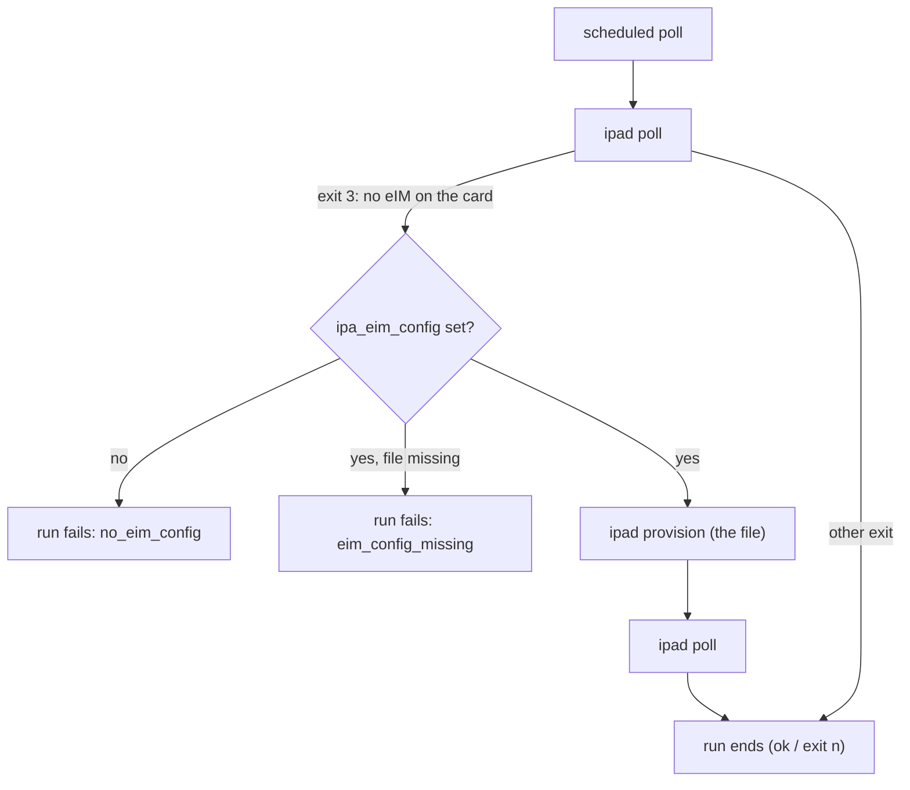
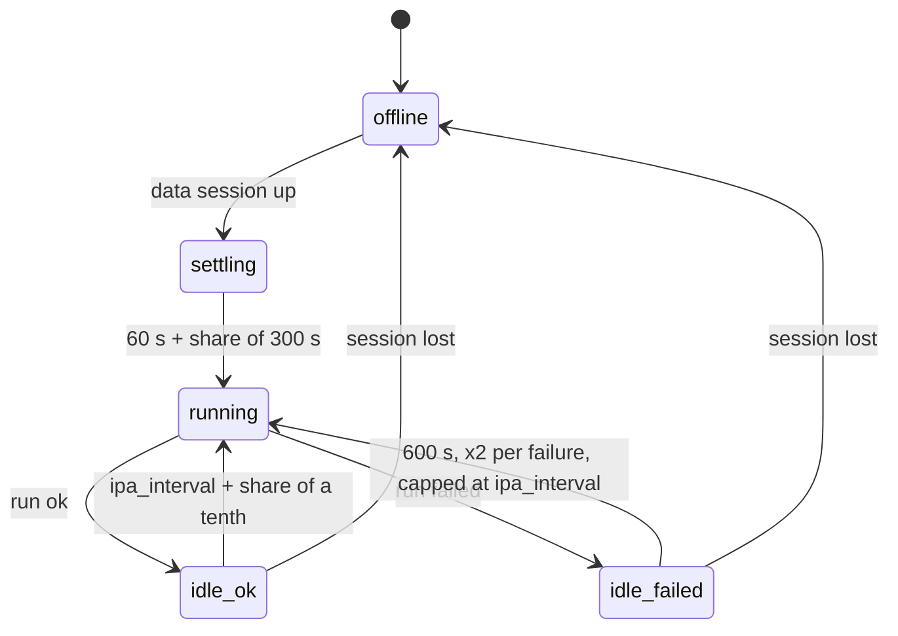

# wwand-ipa how-to

The router-side steps for eSIM fleet management with wwand: installing,
pointing a modem at an eIM, provisioning, the schedule, the `wwandctl ipa`
commands, status and logs, the APN write-back, and troubleshooting.

Related pages:

- [operation.md](operation.md): how a profile switch travels through wwand,
  what rollback and fallback depend on, and a checklist for a working setup;
- ipad's [SGP.22 emulation](https://github.com/ddimension/ipad/blob/main/docs/sgp22-emulation.md):
  how an ordinary consumer eUICC is used for SGP.32;
- ipad's [how-to](https://github.com/ddimension/ipad/blob/main/docs/howto.md):
  ipad on its own.

Everything below was checked against `plugins/ipa.uc`, `ctl/ipa.uc`, the
feed Makefile (`wwand-ipa/Makefile`) and wwand's `esim_bridge.uc`,
`simops.uc` and `deps.uc`.

- [1. Install](#1-install)
- [2. Point the modem at the eIM](#2-point-the-modem-at-the-eim)
- [3. Register the card at the eIM](#3-register-the-card-at-the-eim)
- [4. Options](#4-options)
- [5. The schedule](#5-the-schedule)
- [6. Commands](#6-commands)
- [7. Status and logs](#7-status-and-logs)
- [8. The APN write-back (`origin 'ipa'`)](#8-the-apn-write-back-origin-ipa)
- [9. Troubleshooting](#9-troubleshooting)

## 1. Install

The packages come from the ddimension OpenWrt feed:

| Package | Brings | Depends on |
|---|---|---|
| `wwand-ipa` | the plugin (`/usr/share/ucode/wwand/plugins/ipa.uc`), `wwandctl ipa` (`/usr/share/ucode/wwand/ctl/ipa.uc`), `/lib/upgrade/keep.d/wwand-ipa` | `wwand-esim`, `wwand-ipad` |
| `wwand-ipad` | the assistant, `/usr/lib/wwand/ipad` | `ca-bundle` |
| `luci-app-wwand-ipa` | the *Network → eSIM Fleet* page | `luci-base`, `wwand-ipa` |
| `wwand-esim` | the APDU bridge and lpac | `wwand`, `lpac` (≥ 2.3.0, or `wwand-lpac`) |

wwand needs a backend package for the modem as well, e.g. `wwand-qmi`.

```sh
apk add wwand-qmi wwand-ipa luci-app-wwand-ipa     # opkg install … on opkg releases
```

Nothing starts until `option ipa '1'` is set on a modem. The state directory
`/etc/wwand/ipa` (per-card state, device key, eIM configuration files) is
kept across a sysupgrade through `keep.d`. Without it the card would lose its
eIM.

## 2. Point the modem at the eIM

The options belong to the modem's **`config wwand_modem`** section in
`/etc/config/network`. A modem that still runs on an old-style configuration
has no such section; migrate it first (LuCI, or `/usr/libexec/wwand/migrate`).
`wwandctl ipa provision` and `wwandctl ipa eim` check for it and refuse with
that hint; the other subcommands do not check.

Pick the route that matches what the eIM operator gives you.

### a) A bundle (`eim-ipad-provision/1`)

The eIM operator issues it with `eimctl ipad bundle` (eIM decision D-69).
The bundle holds the eIM configuration and a device key the eIM issued. The
card's EID does not need to be known in advance.

```sh
# over SSH only: the file holds a private key (this works where the router has no scp/sftp)
ssh root@router 'umask 077; cat > /tmp/bundle.json' < bundle.json
ssh root@router wwandctl ipa m0 provision /tmp/bundle.json
```

What happens:

1. `wwandctl` checks that the file starts as an `eim-ipad-provision/1`
   bundle, and that `m0` is a `wwand_modem`.
2. ipad stores the configuration on the card (or in the emulation), puts the
   key in `/etc/wwand/ipa/device.key` (0600) and **deletes the bundle**. If
   ipad could not delete it, `wwandctl` tries once more, and says so if the
   file is still there.
3. `option ipa '1'` is set and wwand reloads. The modem is not restarted.
4. The next poll **binds** the card at the eIM (`POST /ipad/v1/bind`) and
   then polls.

The JSON answer (last line on stdout):

```json
{"result":"ok","eid":"8904…","card_type":"emulated","bound":false,"bind":"pending","counter":0,"key_fingerprint":"3F2A…","last_poll":null,"last_error":null,"bundle_deleted":true}
```

A bundle that could not be stored (expired, or the card already has an
eIM) stays where it is. The answer then carries `bundle_kept`, and stderr
warns that the file holds a private key.

### b) An eIM configuration file

The eIM operator writes it with `eimctl eim-config` (an
`AddInitialEimRequest`, tag `BF57`). A `GetEimConfigurationDataResponse`
(`BF55`) or a single `EimConfigurationData` (`30`) works too.

```sh
wwandctl ipa m0 eim /tmp/eim.ber
```

This checks the file, copies it to `/etc/wwand/ipa/m0-eim.ber` (0600), sets
`option ipa '1'` and `option ipa_eim_config '/etc/wwand/ipa/m0-eim.ber'`, and
reloads. Setting the same by hand:

```
config wwand_modem 'm0'
	option device '/dev/cdc-wdm0'
	option ipa '1'
	option ipa_eim_config '/etc/wwand/ipa/m0-eim.ber'
```

The file reaches the card only while the card has **no eIM yet**. ipad exits
3 ("no eIM configured") on the first poll, and the plugin then runs `ipad
provision <file>` and polls. A card that already has an eIM keeps it. Moving
it to another eIM is the eIM's business (`addEim` / `updateEim`).



## 3. Register the card at the eIM

Only for an **ordinary SGP.22 card**, which ipad emulates. An IoT eUICC signs
with its own certificate and needs nothing here.

- **With a bundle:** nothing to do. The card binds itself on its next poll.
  `wwandctl ipa m0 info` shows `bind`: `pending`, then `done`.
- **With a configuration file:** export the import file and import it on the
  eIM:

  ```sh
  wwandctl ipa m0 export /tmp/device.json      # router
  eimctl euicc import device.json              # eIM
  ```

  Until the eIM has the key it rejects the card's results: they arrive but
  are never acknowledged.

## 4. Options

On the `wwand_modem` section:

| Option | Default | |
|---|---|---|
| `ipa` | off | fleet management for this modem |
| `ipa_eim_config` | – | the eIM configuration file for a card without an eIM (an absolute path: letters, digits, `._/-`, no `..`) |
| `ipa_eim_id` | the first | which eIM, when the card has several (`-e`) |
| `ipa_interval` | 3600 | seconds between polls. Values from 1 to 299 become 300; 0, a negative value or one that is not a number gives the default 3600 |
| `ipa_backend` | `auto` | `iot` or `emu` to skip the probe |
| `ipa_direct` | on | offer direct downloads (lpac) to the eIM (`-D`) |
| `ipa_insecure` | off | no TLS verification of the eIM (`-k`), lab only |

Changing them does not restart the modem: plugin options are left out of the
modem's reload signature. The eIM's TLS identity comes from the eIM
configuration (`trustedPublicKeyDataTls`: a pinned key, its certificate or
its CA), otherwise from the system CAs.

## 5. The schedule

The daemon's 10-second status tick asks the plugin whether a poll is due
(`due()` in `plugins/ipa.uc`):

- nothing happens while the modem has no data session;
- the first poll comes one minute after the connection is up, plus up to
  five minutes more;
- after a good run, the next one comes after `ipa_interval`, plus up to a
  tenth more;
- after a failed run, the retry comes after 600 s, doubling with each further
  failure, never beyond the interval.

The extra time is fixed per router: it is derived from the IMEI (FNV-1a). A
fleet that comes back from one power cut therefore does not reach the eIM in
the same second, and it stays spread out afterwards. Only a poll moves the
schedule. `export`, `provision` and `info` do not count as runs.



The card managed is the modem's **active eUICC**. On a dual-SIM module that
can be the second physical slot. A modem that cannot list its slots uses
`sim_slot`, or 1.

A run is exclusive with lpac operations on the same card: whichever comes
second gets `busy`. While `option ipa` is on, manual `download`, `enable`,
`disable`, `delete` and `notify` on that card are refused with
`esim_managed`, unless `"force": true` is passed. LuCI does not offer those
controls on a managed card.

## 6. Commands

```
wwandctl ipa [modem]                    # state, schedule, the card, the last run
wwandctl ipa [modem] poll [--timeout S] # poll now and wait for the end (JSON), default 300 s
wwandctl ipa [modem] poll --no-wait     # only start it
wwandctl ipa [modem] eim <file>         # set the eIM configuration, enable
wwandctl ipa [modem] export <file>      # the eIM import file (emulated card)
wwandctl ipa [modem] provision <bundle> # store a bundle, enable (JSON)
wwandctl ipa [modem] info               # the card now (JSON)
wwandctl ipa [modem] reset              # forget configuration, state, key (JSON)
```

`[modem]` is the `wwand_modem` section name. It can be left out on a router
with one modem.

`provision`, `poll`, `info` and `reset` are meant for scripts as well. They
print one JSON object as the last line on stdout, messages for people go to
stderr, and the exit status is:

| Exit | |
|---|---|
| 0 | done (`poll`: the run completed — the eIM had no more packages, or ipad stopped after its cap of 16 packages in one run and the rest waits for the next poll) |
| 1 | failed: the eIM or the network, the card, an argument (`error` says which) |
| 2 | the eIM refused to bind the card (403) |
| 3 | not supported here: ipad or wwand-esim not installed |

Examples:

```sh
# a package was just queued on the eIM: run it now and see what happened
wwandctl ipa m0 poll --timeout 600
# {"result":"ok","packages":2,"results":1,"notifications":2,"bound":true,"bind":"done","eid":"8904…","error":null}

# what the router has on this card
wwandctl ipa m0 info
# {"eid":"8904…","card_type":"emulated","bound":true,"bind":"done","counter":7,"key_fingerprint":"3F2A…","last_poll":1790000000,"last_error":null}
```

- `poll` waits for a run already under way (a scheduled one) to end, then
  runs its own.
- `reset` runs `ipad reset`: it deletes `device.key`, **every** `*.state` in
  `/etc/wwand/ipa` and the binding markers. While a run holds the card it
  waits for it, up to 120 s, then fails `busy`. The uci options stay, and so
  does the configuration file `ipa_eim_config` names (`<modem>-eim.ber` is
  not a state file). What the next poll does depends on that option:
  - **`ipa_eim_config` not set** (a bundle was used): polls fail
    (`no_eim_config`) until something new is provisioned.
  - **`ipa_eim_config` set:** the next poll — the schedule's, not only yours
    — finds no eIM (ipad exit 3) and the plugin provisions that **old** file
    again, on its own: the old configuration with its old counter, and a
    new device key the eIM does not know. So at a reset, replace the file
    first (`wwandctl ipa m0 eim <file>` with a configuration at the counter
    you need, see [Re-keying](#re-keying-after-a-lost-device-key)), or remove
    the option (`uci delete network.m0.ipa_eim_config`, commit, `ubus call
    wwand reload`).

  Because the directory is shared, a reset affects every modem on the
  router. An IoT eUICC keeps its eIM configuration: only the eIM can remove
  it.

Over ubus the same operations are `modem_plugin { modem, plugin: "ipa", op }`
with `op` one of `status`, `poll` (returns once the run has started),
`export { file }`, `provision { file }`, `info` and `reset`. The read-only
`modem_plugin_status` reaches `status` only.

## 7. Status and logs

**`wwandctl ipa`** (plain text):

```
eIM          idle · 12 runs · 1 profile change
last run     4 min ago · ok
next poll    in 56 min
card         EID 89049032… · SGP.22 card, emulated · device key 3F2A9C0B11D4E7A2…
connectivity 8949…: none stated (emulated: none) → wwsim_8949… kept as it is
last changes switched 8949…01 → 8949…02
```

**LuCI → Network → eSIM Fleet** shows the same per modem, including the
downloads of the last run, and has a *Poll now* button. The page reads
through `modem_plugin_status` and polls through `modem_plugin`.

**`ubus call wwand modem_plugin_status '{"modem":"m0","plugin":"ipa","op":"status"}'`**
returns the full record: `state` (`idle`, `running`, `waiting_online`,
`downloading`), `eid`, `backend`, `key_fingerprint`, `bind`, `counter`,
`last_poll` (with ipad's own summary: packages, acknowledged results, exit
code, error), `runs`, `profile_changes`, `last_*`, `fails`, `next_due`,
`interval`, `last_changes` (switches with a `rollback` flag, installs,
deletions, downloads) and `connectivity`.

**Logs:**

```sh
logread -e ipad            # ipad's own account: packages, switches, rollbacks, binding, TLS
logread -e wwand | grep ipa   # the plugin: schedule, SIM reset, waiting, write-back
```

Plugin lines to look for:

- `ipa: polling the eIM (schedule)`
- `ipa: the eIM changed the active profile — resetting the SIM and waiting for the connection`
- `ipa: connection back after the profile change` / `connection NOT back …`
- `ipa: profile switched A -> B` / `ipa: profile rolled back B -> A`
- `ipa: profile … installed by the eIM` / `… deleted by the eIM`
- `ipa: connectivity parameters of … written to wwsim_… (…)`
- `ipa: run failed (…)`

## 8. The APN write-back (`origin 'ipa'`)

After every poll ipad reads the enabled profile's connectivity parameters
(SGP.32 5.9.24) and hands them to the plugin. The plugin keeps a
`wwand_sim` section named `wwsim_<iccid>` for that profile:

```
config wwand_sim 'wwsim_89000123456789012342'
	option iccid '89000123456789012342'
	option origin 'ipa'
	option apn 'iot.example'
	option pdp_type 'ipv4v6'
```

- **The card states parameters** (IoT eUICC with a profile that carries
  them): `apn` and `pdp_type` are written, plus `username`, `password` and
  `auth 'both'` when credentials are present. The section is kept up to date
  on every poll.
- **The card states nothing:** this is always the case for an emulated SGP.22
  card. The section is **created** with the ICCID only, for you to fill in.
  Later polls never touch it again (`create_only`), so what you add stays.
- **A hand-written `wwand_sim` for the same ICCID is never touched.** While
  any section without `origin 'ipa'` exists for that ICCID, the plugin
  neither creates nor updates `wwsim_<iccid>`, and the status reports
  `foreign` ("left to your wwand_sim …"). That is only true of the
  write-back, though: wwand itself uses the **first** `wwand_sim` whose ICCID
  matches, in the order of `/etc/config/network`, and does not look at
  `origin` (`match_sim_override`). A section you add *after* the plugin
  wrote `wwsim_<iccid>` sits below it and loses. Then delete
  `wwsim_<iccid>`, or take it over (below) instead of adding a second one.
- **To take a written section over,** delete its `option origin` line.
- A write reloads wwand's configuration without restarting the modem. The new
  values take effect at the **next card read** (the next SIM reset or modem
  start). The session already running keeps its APN.

The write-back comes *after* the switch and after the poll, so it is too late
for the first connection of a brand-new profile. The APN has to be right
before the switch. [operation.md](operation.md#getting-the-apn-right-before-the-switch)
explains how.

## 9. Troubleshooting

| Symptom (`last_error`, log) | Meaning and fix |
|---|---|
| `no_eim_config` | the card has no eIM and `ipa_eim_config` is not set: provision a bundle or set a configuration |
| `eim_config_missing` | `ipa_eim_config` names a file that is not there (lost in an upgrade without `keep.d`?) |
| `ipa_not_installed` | `/usr/lib/wwand/ipad` is missing: install `wwand-ipad` |
| `esim_not_installed` | `wwand-esim` is not installed |
| `busy` | an lpac operation or another run holds the card. `wwandctl ipa poll` waits for it |
| `invalid_argument` (`ipa_eim_config`, `ipa_eim_id`, `file`) | a path or id with characters outside the allowed set |
| `exit 1` + ipad's reason | see `logread -e ipad`: TLS, HTTP, the card |
| `exit 4`, `bind: refused`, `wwandctl` exit 2 | the eIM refused the binding (403). Ask the eIM operator. Polling stays off until a new bundle is provisioned or `wwandctl ipa reset` |
| results never acknowledged (`results: 0`) | the eIM cannot verify the card's results: device key not imported, or replaced. Compare `key_fingerprint` with `eimctl euicc show <EID>` |
| manual eSIM change refused `esim_managed` | the card is managed (`option ipa`). Pass `force` only if you accept that the eIM's view and the assistant's state (rollback target, pending results) go out of step |
| `rolled back` in `last changes` | the new profile did not get a data session within 5 minutes, or the result could not reach the eIM over it. See [operation.md](operation.md#troubleshooting-rolled-back-although-the-profile-is-fine) |
| `connectivity … none stated (emulated: none)` | expected for an SGP.22 card. Fill in the created `wwsim_<iccid>` section, or pre-fill one ([operation.md](operation.md#getting-the-apn-right-before-the-switch)) |
| lost device key | [Re-keying after a lost device key](#re-keying-after-a-lost-device-key), below |
| lost `<EID>.state`, key intact | the card has no eIM (`no_eim_config`, or the file of `ipa_eim_config` is provisioned again). Provision a configuration at the eIM's counter **N** itself (`eimctl euicc show <EID>`), not N+1: the eIM's next package carries N+1, and the emulation refuses counters `<=` its own. No re-key |

### Re-keying after a lost device key

An emulated card whose `device.key` is gone needs its new key imported on the
eIM with `eimctl euicc import --replace-key`, and the eIM takes it only from
an import file whose counter is **strictly above** its own counter N for the
card. `export` writes the emulation's counter, so the emulation has to start
at N+1. The import has to come **before the card fetches its next package**:
that package would carry N+1, which the emulation refuses (its counter is
N+1 already), and would leave the eIM at N+1, so the import would be refused
as well. After the import the eIM stands at N+1 and its next package
carries N+2. The counter rules are ipad's
([how-to](https://github.com/ddimension/ipad/blob/main/docs/howto.md#recover-from-a-lost-device-key)).

```sh
# on the eIM
eimctl euicc show <EID>                                    # its counter N
eimctl eim-config cfg.der --fqdn eim.example.com --counter <N+1>
ssh root@router 'cat > /tmp/cfg.der' < cfg.der

# on the router — the file first: a reset while ipa_eim_config still names
# the old one lets the next scheduled poll provision that one again
wwandctl ipa m0 eim /tmp/cfg.der          # replaces /etc/wwand/ipa/m0-eim.ber
wwandctl ipa m0 reset                     # key, state, binding gone
ubus call wwand modem_plugin '{"modem":"m0","plugin":"ipa","op":"provision","args":{"file":"/etc/wwand/ipa/m0-eim.ber"}}'
wwandctl ipa m0 export /tmp/device.json   # counter N+1, the new key
ssh root@router cat /tmp/device.json > device.json

# on the eIM, then the first poll
eimctl euicc import device.json --replace-key
ssh root@router wwandctl ipa m0 poll
```

The `ubus` call stores the configuration without a poll; `wwandctl ipa m0
poll` would do it too, but polls right after, and would then fetch a queued
package before the import. With fleet management on, the schedule can still
poll in between: queue nothing for the card on the eIM until the import is
done. `reset` clears `/etc/wwand/ipa` for every modem on the router.

Not verified yet: a run on router hardware with an eUICC. The plugin is
tested on the host, through wwand's real eSIM bridge with a stub assistant
(`tests/run_tests.sh`).
