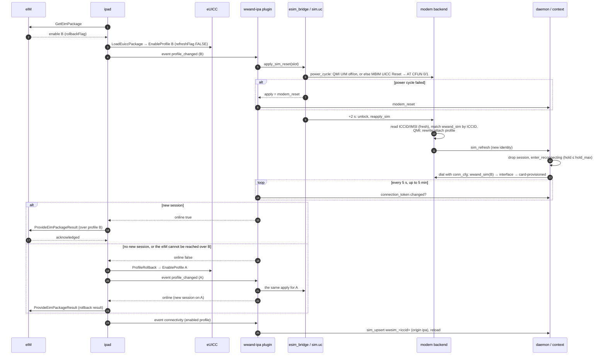
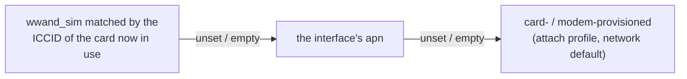

# Operation and setup: profile switches, rollback and fallback with wwand

What happens on the router when an eIM switches the active eSIM profile, what
a switch needs in order to stick, and how wwand's own mechanisms take part.
Read this before the eIM sends its first `enable`.

Sources checked (wwand as of 2026-09-27):

- wwand-ipa: `plugins/ipa.uc`;
- ipad: `src/ipa.c` `handle_package`, `src/emu.c`;
- wwand: `esim_bridge.uc`, `sim.uc` `power_cycle`, `modem.uc`, `modem_mbim.uc`
  and `modem_ncm.uc` `reapply_sim`, `modem_common.uc` `match_sim_override`,
  `daemon.uc` `modem_sim_refresh` and `maybe_autosetup_fill`,
  `context_common.uc` `conn_cfg`, `context.uc`, `context_mbim.uc`,
  `context_ncm.uc`, `ncm_vendors.uc`, `reconnect.uc`, `recovery.uc`,
  `simops.uc`, `deps.uc`, `apndb.uc`.

Claims that come from reading the code rather than from a run on hardware
are marked as such. No run on router hardware with an eUICC has been made
yet.

- [How a profile switch travels](#how-a-profile-switch-travels)
- [What decides "online": the rollback window](#what-decides-online-the-rollback-window)
- [Getting the APN right before the switch](#getting-the-apn-right-before-the-switch)
- [Rollback](#rollback)
- [The fallback attribute](#the-fallback-attribute)
- [wwand mechanisms that take part](#wwand-mechanisms-that-take-part)
- [Checklist: before the first eIM package](#checklist-before-the-first-eim-package)
- [Checklist: running it](#checklist-running-it)
- [Troubleshooting: rolled back although the profile is fine](#troubleshooting-rolled-back-although-the-profile-is-fine)

## How a profile switch travels

1. The eIM queues an eUICC Package with an `enable` PSMO, optionally with
   `rollbackFlag`.
2. ipad fetches it on the next poll and executes it. On an SGP.22 card the
   emulation verifies it, signs the result, saves the state and then calls
   `ES10c.EnableProfile` with `refreshFlag` FALSE. On an IoT eUICC the card
   does all of that itself.
3. ipad sees that the enabled ICCID changed and sends wwand the event
   `profile_changed`.
4. The plugin (`on_profile_changed`) resets the SIM through
   `esim_bridge.apply_sim_reset` → `sim.power_cycle`. That picks ONE path by
   what the modem has: QMI UIM power off/on where there is a UIM client
   (native, or over the MBIM passthrough); otherwise MBIM UICC Reset, and AT
   `CFUN=0/1` if that fails or is not there. A failing QMI UIM power cycle
   does not go on to MBIM or AT.
   - If the power cycle fails, the apply falls back to `modem_reset`, and the
     plugin calls the daemon's modem reset itself, because nobody would press
     the button in LuCI.
5. Two seconds after the card is back, wwand unlocks it (the PIN may re-arm)
   and runs the backend's `reapply_sim`:
   - it reads the identity fresh (ICCID, IMSI);
   - it re-matches the `wwand_sim` sections by ICCID (`match_sim_override`),
     logging `sim reapply: iccid … imsi … (matched a configured wwand_sim)`;
   - on QMI it also rewrites the attach profile with the matched APN.
6. The daemon sees the new identity (`modem_sim_refresh`) and drops the
   session: "interface …: the SIM changed under it — dropping the session so
   it re-dials on the new subscription". The interface is held up while wwand
   reconnects (`enter_reconnecting`, at most `hold_max`, 90 s by default).
7. wwand dials again with the APN resolved for the new card (`conn_cfg`:
   the matching `wwand_sim` → the interface → the card-provisioned APN).
8. When a **new** data session is up, the plugin's connection token moves,
   and the plugin answers ipad `{"online":true}`. ipad then delivers the
   result to the eIM over the new profile.
9. If there is no new session within 5 minutes, the plugin answers
   `{"online":false}`. The same happens when the result cannot reach the eIM
   over the new session. ipad then calls `ProfileRollback`, which succeeds
   only if the enable carried `rollbackFlag`. wwand applies the rollback
   exactly the same way (steps 3 to 8, for the old ICCID), and ipad reports
   the rollback's result instead.



## What decides "online": the rollback window

- **A new session, not "connected".** After a SIM reset the old session is
  still CONNECTED until the daemon notices the identity change and drops it.
  The plugin therefore waits for the modem's *connection token* to change
  (`simops.uc connection_token`: the connection generation of the first
  CONNECTED interface of the modem, by name). It checks every 5 s.
- **5 minutes, fixed** (`online_timeout` 300 s in `plugins/ipa.uc`). This is
  not a uci option. The comment in the code explains the choice: a new
  profile may first have to register on a network the modem has not seen,
  and answering too early costs a rollback nobody asked for.
- **The eIM must be reachable over the new profile.** Even with a new
  session, ipad rolls back if `ProvideEimPackageResult` fails (`handle_package`:
  `n < 0 && changed`). A profile whose APN is a private network without a
  route to the eIM gets rolled back although it connects.
- **Without `rollbackFlag`** in the enable, `ProfileRollback` answers
  `rollbackNotAllowed`. The card stays on the new profile, and the result
  stays stored on the card (or in the emulation) until the eIM fetches it.

## Getting the APN right before the switch

The new profile must get a data session **within the window, on its first
try**. wwand resolves the APN when it dials, per field (`context_common.uc
conn_cfg`):



The same order applies to `auth`, `username`, `password` and `pdp_type`,
except that `pdp_type` falls back to `ipv4v6`, not to the card.

The eIM's own APN data does not help here. The write-back (`wwsim_<iccid>`,
`origin 'ipa'`) happens after the poll, so it is too late for the first
connection of a new profile, and an emulated SGP.22 card reports no
parameters at all. There are three ways to have the APN ready in time.

### 1. An empty APN on the interface: let the network or profile decide

```
config interface 'wan'
	option proto 'wwand'
	option modem 'm0'
	option apn ''            # or no apn line at all
	option pdp_type 'ipv4v6'
```

What wwand does with an empty APN, per backend:

| Backend | Empty APN means |
|---|---|
| MBIM | `MBIM CONNECT` with a blank access string: the network assigns its default PDN (`context_mbim.uc`) |
| NCM (AT) | `AT+CGDCONT=<cid>,"<type>",""`: "blank ⇒ network default" (`ncm_vendors.uc`) |
| QMI | the APN stored in the modem's attach profile is used and logged: "attach profile …: no config APN — using SIM/modem-provisioned APN …". A blank APN is never written (`context.uc`) |

This works when the network hands out a usable default APN to an empty
request. Many consumer networks do; many M2M and private-APN subscriptions do
not.

**QMI caveat (read from the code, not verified on hardware).** On QMI the
"provisioned" APN is the one in the **modem's** attach profile, not on the
card. wwand writes that profile whenever a configured APN differs from it,
and never clears it for an empty one. After a profile whose `wwand_sim`
carried an APN, a later profile without a `wwand_sim` therefore attaches with
the **previous** profile's APN. Whether the modem firmware re-provisions the
profile on a card change (carrier MBN auto-selection) is modem-specific and
not examined here.

### 2. The APN table wwand knows (autosetup)

`apndb.uc` holds a short ICCID/IMSI prefix table: Deutsche Telekom DE,
Vodafone DE, 1NCE, Vodafone GDSP global M2M. Its limits make it a poor fit
for eIM switches:

- **Autosetup only.** It is used only when wwand created the configuration
  itself (no `wwand_modem` and no `proto wwand` interface existed) and the
  interface still carries `option autosetup '1'`.
- **Once, when it matches.** On a match the values are copied into the
  **interface** and the marker is removed; from then on the table is never
  consulted again, including for profiles the eIM enables later. Without a
  match (or when the card's own APN wins, below) the marker stays, and the
  table is looked at again at the first registration after the next wwand
  start — once per interface per daemon run, not at a profile switch within
  a run.
- **Only when the card provisions nothing.** A card-provisioned attach APN
  wins, and a backend that did not report one skips the table.
- **It writes the interface, not a per-ICCID entry.** The copied APN becomes
  the generic default for **every** later profile, including one from another
  operator, unless a `wwand_sim` overrides it.

It is useful for the router's first card. It does nothing for the profiles
an eIM switches to.

### 3. Pre-fill the per-ICCID table: a `wwand_sim` for every expected profile

This is the dependable way. Before the eIM downloads or enables a profile,
create a section for its ICCID:

```
config wwand_sim 'fleet_opA'
	option iccid '89440000000000000011'
	option apn 'm2m.operator-a.example'
	option pdp_type 'ipv4'
	option auth 'chap'
	option username 'user'
	option password 'secret'

config wwand_sim 'fleet_opB'
	option iccid '89330000000000000022'
	option apn 'iot.operator-b.example'
	option pdp_type 'ipv4v6'
```

- The section applies to any modem unless it carries `option modem`. It is
  matched by ICCID, and trailing `F`s and case are ignored.
- Adding one **does not restart** modems: SIM overrides are outside the
  modem's reload signature. The list is handed to the running modem, and the
  section takes effect at the next card read, which after a switch is the
  SIM reset in step 5.
- The plugin never touches a hand-written section (without `origin 'ipa'`),
  and while one exists for the ICCID it neither creates nor updates
  `wwsim_<iccid>`; it reports it as `foreign`. wwand, however, uses the
  **first** matching `wwand_sim` in `/etc/config/network` order, whatever
  its `origin` (`match_sim_override`): a hand-written section added after
  the plugin wrote `wwsim_<iccid>` comes second and is not used. Delete
  `wwsim_<iccid>` then, or make it yours (next point).
- If the plugin created `wwsim_<iccid>` first (emulated card: ICCID only),
  fill in that section, or delete its `origin` line to make it yours.
- A `wwand_sim` can also carry `pincode`. On an eSIM profile that is rarely
  needed.

Combining ways 1 and 3 works well: an empty APN on the interface as the
generic default, plus a `wwand_sim` for every ICCID whose network needs a
specific APN.

## Rollback

- **Asked for by the eIM** with `rollbackFlag` on the `enable` (SGP.32 3.4.1).
  Only the next package clears the grant, and ipad persists it (emulation:
  `<EID>.state`).
- **Triggered by the device.** ipad calls `ProfileRollback` (5.9.16) when the
  result of a package that changed the profile cannot be delivered (3.3.2):
  the plugin said offline, or the eIM was not reachable.
- **Applied like any switch.** The emulation enables the old profile. ipad
  sends `profile_changed` for the old ICCID, and wwand runs the same SIM
  reset, re-match and re-dial. The rollback's result replaces the package's
  result (3.3.2 NOTE1).
- **Visible** in `wwandctl ipa` (`last changes: rolled back B → A`), in the
  status (`last_changes.switched[].rollback`), in ipad's log ("profile rolled
  back to …") and in the plugin's log ("profile rolled back …").
- **The old profile must connect as well.** The rollback's result goes to the
  eIM over the old profile's new session. If that fails too, the result stays
  stored and goes out on a later poll or when the eIM asks for it.

## The fallback attribute

What SGP.32 defines:

- `setFallbackAttribute` (3.4.6) marks one profile as the Fallback Profile.
  Only a profile whose metadata has `fallbackAllowed` qualifies.
- On a permanent loss of connectivity, the **device** may call
  `ExecuteFallbackMechanism` (5.9.20) to enable it, and `ReturnFromFallback`
  (5.9.21) to go back.
- How the device detects that loss "is implementation specific" (2.11.1.1.3
  NOTE).

What happens in this stack:

| | IoT eUICC | SGP.22 card (emulated) |
|---|---|---|
| Setting and unsetting the attribute | the card | ipad's state. `setFallbackAttribute` needs `fallbackAllowed` (`9F67`), which SGP.22 profiles normally lack. The answer is then `fallbackNotAllowed`, unless ipad runs with `-F`, which wwand-ipa does not pass |
| Attribute visible in the profile list | the card | ipad adds `fallbackAttribute` to `GetProfilesInfo` |
| Deleting the profile to return to while fallback is active | refused by the card | refused (`returnFallbackProfile`) |
| **Executing the fallback** | only when the IPA calls it | only when the IPA calls it |

**Neither ipad nor wwand-ipa calls `ExecuteFallbackMechanism` or
`ReturnFromFallback`.** There is no connectivity-loss detector that would
trigger them, and wwand-ipa does not pass `-C` (the `notifyStateChange` cause
for "fallback"). In the current code, the fallback attribute is recorded and
reported but never acted on. wwand's answer to a lost connection is its own
recovery ladder (below), not a profile change.

If a fallback **were** executed (by a future trigger, or by other software
talking to the card), wwand would handle it like any identity change: a SIM
reset or other card read would be needed for the modem to see the new
profile (`sim.uc power_cycle` notes that the RG650E ignores the eUICC REFRESH
and keeps the old identity), then `modem_sim_refresh` drops the session and
wwand re-dials with the fallback profile's `wwand_sim`. The plugin would not
learn of it, because only `handle_package` sends `profile_changed`. So the
Fallback Profile needs its APN pre-filled like any other.

## wwand mechanisms that take part

| Mechanism | What it does during a switch | What to watch |
|---|---|---|
| **SIM reset** (`sim.power_cycle`) | the card is off for a moment. The modem drops its cached SIM state and re-reads the card | `eSIM apply: sim power-cycle failed … modem reset needed`: the plugin then resets the modem, which takes longer |
| **Identity change** (`modem_sim_refresh`) | drops the session so it re-dials on the new subscription. A mere re-read of the same card, or an IMSI that only now became readable, is not a change | `the SIM changed under it` |
| **Reconnect hold** (`reconnect.uc`, `wwand_globals option hold_max`, default 90 s) | keeps the interface up while wwand re-dials, so netifd, IPv6-PD and VRF are not torn down. When the hold expires the interface is taken down as an involuntary give-up | `reconnect hold expired, downing …`. After that the interface comes back on the modem's next `registered` ("service returned, reconnecting after earlier give-up") |
| **A block while the card is away** (STATUS.md, "A block after a card change comes back by itself", 2026-09-27) | a setup that lands in the cardless moment can be answered `sim_blocked`. wwand now treats that as its own give-up and re-arms the interface on the next `registered`, instead of leaving autostart cleared | the host tests cover it. STATUS.md records the hardware round on the Chateau (245) as open |
| **Recovery ladder** (`recovery.uc`: opmode cycle @ 8, modem reset @ 16, board repower @ 24 failed connection cycles, then reboot per `failreboot`) | failed dials on the new profile count like any failed connection cycle. A successful connection resets the count | a profile with a wrong APN collects failures. Whether a rung fires inside the 5-minute window depends on the retry cadence, which is not measured here. A rung firing mid-switch (an opmode cycle or modem reset) delays the new session |
| **`esim_managed` guard** (`simops.uc`) | while `option ipa` is on and wwand-esim is installed, `modem_esim` refuses `download`, `enable`, `disable`, `delete` and `notify` (`"force": true` overrides). `status` shows `esim_managed_by` | a forced manual change desynchronises ipad's rollback target and pending results from the card |
| **Card claim** (`esim_bridge` `session_run`) | an ipad run holds the card like an lpac operation. Others get `busy` | a long wait in `profile_changed` (up to 5 min) keeps lpac operations on that card waiting |
| **A direct download's PIR** (`esim_bridge` `session_download`, `session_notify`) | lpac downloads without its notification step; ipad reports the PIR to the eIM, then asks (event `notify`) for `lpac notification process -r <seq>`, which sends that PIR to the SM-DP+ (SGP.32 3.2.3.1 step 14) and removes it once acknowledged | `install notification not sent to the SM-DP+`: the PIR stays on the card, recorded in `/etc/wwand/ipa/<EID>.es9`, and goes out over ES9+ on the next run, never to the eIM |
| **`option lowpower`** | parks the radio when the operator takes the last interface of the modem down. It never parks on a transient loss, such as a switch | polls need a data session. With the radio parked there are no polls, so eIM packages wait |
| **Autosetup** | copies an APN into the interface once, for the first card (see way 2) | an APN copied there becomes the default for every later profile |

**Not verified:** after a SIM power cycle, the logical channel ipad opened
to the ISD-R before the reset may no longer exist. Neither ipad (`card.c`)
nor the bridge reopens a channel after a failed transmit. How the card calls
in the rest of that run behave after a real SIM reset has not been observed
on hardware; the host tests use a simulated card whose channel survives. The
same applies to a modem reset in the middle of a run, which replaces the
modem object behind the bridge.

## Checklist: before the first eIM package

1. **Packages:** `wwand-ipa`, `wwand-ipad`, `wwand-esim` (with lpac ≥ 2.3.0),
   the modem's backend, optionally `luci-app-wwand-ipa`.
2. **The modem is on the network-native config**: a `config wwand_modem` and
   a `proto wwand` interface.
3. **The eIM is set:** `wwandctl ipa m0 provision <bundle>` or `wwandctl ipa
   m0 eim <file>`. For an SGP.22 card without a bundle, also export the
   import file and import it on the eIM.
4. **`wwandctl ipa m0 info`** shows the EID, `card_type`, `key_fingerprint`
   and (with a bundle) `bind: done` after the first poll.
5. **APN per expected profile:** a hand-written `wwand_sim` for every ICCID
   the eIM will download or enable, including the Fallback Profile, or an
   empty interface APN if every such network hands out a working default.
   Check the QMI caveat above.
6. **The eIM is reachable from every profile's APN.** A private APN without a
   route to the eIM gets rolled back.
7. **Ask the eIM operator to use `rollbackFlag`** on enables, so a profile that
   does not connect is undone rather than leaving the router offline.
8. **Test one switch while you are watching:** queue the enable, run
   `wwandctl ipa m0 poll --timeout 600`, and watch
   `logread -f -e wwand -e ipad`.
9. **Remote access:** if the router is reached over the cellular link itself,
   plan for the up to 5 minutes (plus a rollback) during which it is offline.

## Checklist: running it

| Where | What |
|---|---|
| `wwandctl ipa [modem]` | `last run` ok, `next poll`, `card`, `connectivity`, `last changes` (switches, rollbacks, installs, deletions) |
| LuCI → Network → eSIM Fleet | the same per modem, with *Poll now* |
| `ubus call wwand status` | per modem: `iccid`, `esim_managed_by`, the interfaces' states and the recovery view |
| `ubus call wwand modem_plugin_status '{"modem":"m0","plugin":"ipa","op":"status"}'` | the full plugin record (`last_poll.summary`, `fails`, `connectivity`) |
| `logread -e ipad` | packages, "enabled profile … -> …", "profile rolled back to …", binding, TLS warnings |
| `logread -e wwand` | `ipa: …` lines, `sim reapply: …`, `the SIM changed under it`, `reconnect hold expired`, recovery rungs |
| the eIM | results acknowledged (a result that is never acknowledged points at the device key), the card's profile list |

## Troubleshooting: rolled back although the profile is fine

In the order to check them:

| Cause | How to tell | Fix |
|---|---|---|
| **No APN or the wrong APN for the new profile** | `logread -e wwand` after the switch: `sim reapply: iccid B …` **without** "(matched a configured wwand_sim)", then failed activations, "reconnect hold expired" | pre-fill a `wwand_sim` for ICCID B ([way 3](#3-pre-fill-the-per-iccid-table-a-wwand_sim-for-every-expected-profile)) |
| **Empty APN not accepted by that network** | an activation with the empty APN ("network default", or on QMI "no config APN — using …") is refused | a `wwand_sim` with the APN |
| **QMI: the attach profile still holds the previous profile's APN** | "attach profile …: no config APN — using SIM/modem-provisioned APN `<A's APN>`" after switching to B | a `wwand_sim` for B. The re-match after the SIM reset then rewrites the attach profile |
| **Wrong `pdp_type`** (e.g. `ipv4v6` on an IPv4-only subscription) | activation refused, or connected without the expected family | `option pdp_type` in the `wwand_sim` |
| **The eIM is not reachable over the new profile** | the plugin logged "connection back after the profile change", yet ipad rolled back ("profile rolled back to …") | a route or APN that reaches the eIM from that profile |
| **The new profile needs longer than 5 minutes** (first registration on a new network, a slow modem reset) | "connection NOT back after the profile change" with a session appearing afterwards | fix the cause of the delay. The window itself is fixed in the code |
| **The SIM reset did not take** | "eSIM apply: sim power-cycle failed (…) — modem reset needed" and "the SIM could not be reset — resetting the modem" ("SIM reset failed" only when wwand-esim is missing), and the modem kept the old ICCID | check the modem's APDU backend (`sim.apdu_backend`) and its REFRESH/reset behaviour |
| **The recovery ladder fired during the window** | recovery rung lines around the switch | usually a consequence of one of the causes above |

A rollback needs `rollbackFlag`. Without it the card stays on the new
profile. If that profile does not connect, the router stays offline until
the eIM can reach it again. With no session there are no polls, so from the
router's side only a manual change (with `force`) gets it back.
